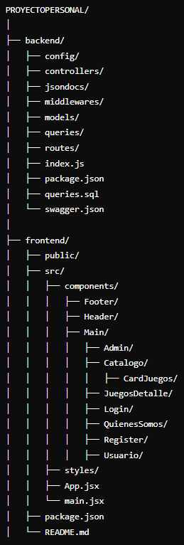

# BorrowGames

## Descripción del Proyecto

BorrowGames es una plataforma web innovadora que permite a los amantes de los juegos de mesa tomar prestados sus juegos favoritos de forma fácil y conveniente. Nuestro servicio permite a los usuarios registrados seleccionar hasta 3 juegos a la vez por un período de una semana, fomentando así la diversión y el intercambio en la comunidad de jugadores.

## Características Principales

- **Registro y Autenticación de Usuarios**: Sistema seguro de login para gestionar las cuentas de los usuarios.
- **Catálogo de Juegos**: Amplia selección de juegos de mesa disponibles para préstamo.
- **Sistema de Reservas**: Los usuarios pueden reservar hasta 3 juegos simultáneamente.
- **Gestión de Préstamos**: Control automatizado de la duración del préstamo (1 semana).
- **Búsqueda y Filtrado**: Funcionalidades para encontrar fácilmente los juegos deseados.
- **Panel de Usuario**: Donde los usuarios pueden ver sus préstamos actuales y el historial.

## Tecnologías Utilizadas

### Frontend
- React
- React Router 6
- Material-UI 5
- Emotion (para estilos en JS)
- Vite (herramienta de construcción)
- SASS
- React Icons
- Normalize.css

### Backend
- Node.js
- Express
- PostgreSQL
- bcryptjs
- JSON Web Token
- Passport
- Swagger
- dotenv
- CORS
- express-validator

### Herramientas de Desarrollo
- ESLint
- Nodemon
- Concurrently
- JSDoc
- Morgan

## Estructura de protecyo

## Organización

### Manejo de ramas GitHub

### Manejo de Trello

### Documentacion JSDoc

### Swagger

## Diseño de Producto
### Vista Catalogo Movil

### Vista Detalles Movil

### Vista perfil Movil

### Vista Quienes Somos Movil

### Vista Catalogo Ipad

### Vista Detalles Ipad

### Vista perfil Ipad

### Vista Quienes Somos Ipad
 "Vista home Quienes Somos")
### Vista Catalogo Desktop

### Vista Detalles Desktop

### Vista perfil Desktop

### Vista Quienes Somos Desktop
 "Vista home Quienes Somos")

## Objetivos

✅ Bases de datos y app.

✅ Se implementó un menú hamburguesa.

✅ Se trabajó con diferentes vistas en React.

✅ Se utilizó adecuadamente el modelo Vista-Controlador.

✅ Se implementó el uso de JSDOC para la la documentación.

✅ Se consiguió una vista mobile First.

✅ Se logró un trabajo ordenado gracias a la puesta en marcha de una metodología ágil (Scrum, Trello).

✅ Se gestionó de manera correcta el uso de ramas en GitHub.

## Instalación y Configuración

1. Clona el repositorio:
    [Repositorio(https://github.com/steph-d989/ProyectoPersonal.git)]

2. Instala las dependencias del backend:
    npm i

3. Instala las dependencias del frontend:
    cd client
    npm i

4. Configura las variables de entorno:
- Crea un archivo `.env` en la carpeta backend.
- Añade las variables necesarias (DB_URL, SECRET_KEY, etc.)

5. Inicia el servidor backend:
    npm run dev

6. Inicia la aplicación frontend:
    npm run dev

## Uso

1. Registra una cuenta o inicia sesión.
2. Navega por el catálogo de juegos.
3. Selecciona hasta 3 juegos para reservar.
4. Confirma tu reserva.
5. Devuelve los juegos dentro del plazo de una semana.

## API Endpoints

- `POST /api/juegos`: Crear un nuevo juego
- `DELETE /api/juegos/:nombre`: Eliminar un juego por nombre
- `GET /api/juegos`: Obtener todos los juegos o buscar por nombre
- `PUT /api/juegos`: Editar la disponibilidad de un juego
- `GET /api/juegos/paginacion`: Obtener juegos con paginación
- `POST /api/reservas/crear`: Crear una nueva reserva
- `DELETE /api/reservas/borrar`: Eliminar una reserva
- `GET /api/reservas/:email`: Obtener reservas de un usuario

## Documentación

- Swagger UI: Accesible en `/api-docs` cuando el servidor está en ejecución.
- JSDoc: Documentación del código generada en la carpeta `/api-jsdocs`.

## Contribución

Las contribuciones son bienvenidas. Por favor, abre un issue para discutir los cambios propuestos antes de hacer un pull request.

## Licencia

[Especifica la licencia del proyecto]

## Contacto

Stephani Damiani - [Contacto(https://github.com/steph-d989)]